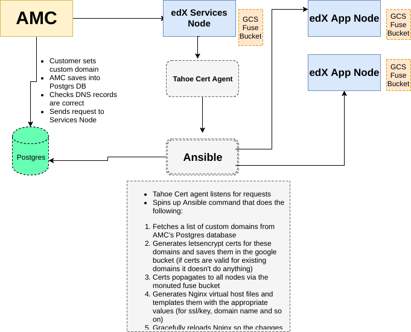

# Tahoe Custom Domains

## How it works

* Customer goes to `/app/general-settings/customer-domain` in the AMC dashboard
* Customer navigates the interface and set a custom domain like `openedx.mydomain.com`
* At that point AMC sets this domain in the Microsite.custom_domain field and in the
  AlternateDomain model on the edx side
* The customer is advised to update their DNS and make `openedx.mydomain.com` a CNAME for
  tahoe.appsembler.com
* Once the change propagates the customer can click the "Check DNS" button which will verify
  that the CNAME is in place and pointing to the correct address (tahoe.appsembler.com)
* Customer clicks the "Enabled/Activate domain" button
* At this point AMC makes the switch in the database (on the edx side, by switching the Site model
  and AlternateDomain objects) and calling out to `Tahoe Cert Agent` to activate the domain
* Tahoe Cert Agent invokes an Ansible command specified in `appsembler-roles/cert_agent/defaults/main.yml`
  `ansible_cmd` variable. In short in invokes the ansible tags
  "--tags=sudo,custom_domains,letsencrypt:run,nginx:custom_domains"

### Tahoe Cert Agent ([repo](https://github.com/appsembler/tahoe_cert_agent))

We created a google bucket in `amc/deploy/terraform/main.tf` that is used for storing the certs. We mount that bucket onto
the edX services node and all the edX app nodes.

We have to make sure that the cert_agent user (which runs the Tahoe cert agent service) has access to all the edX nodes
via ssh (because it will run Ansible and it needs ssh access).  The way we do this is by installing a ssh private key
for that user (located in `edx-configs/appsembler/amc/staging/files/vault/secrets.yml`). We made sure to copy the public
key manually to the `appsembler-amc` project through the GCP console in advance.

We've established that Once the cert_agent user gets a request to activate a domain it needs to be able to SSH to every
edX app node.  Apart from that it needs to be able to `sudo su` into any user as specified in the roles it runs with the
`become_user` Ansible directive. This is the reason why we're running the `sudo` role first. It takes care of that.

After the `sudo` role the process need to fetch a list of custom domains that lives in the AMC app Postgres database.
To be able to do that we invoke a Django management command on one (via the `run_once` directive) of the edX app nodes
that goes into the Postgres database and fetches that info (we're already using AMC's database in edX for the Tiers data).
Once that info is there we use it to set the `letsencrypt_certs` Ansible variable that's later used in other tasks. It's
important to note that this command (Ansible tag `custom_domains`) has to run before any tag that requires the
letsencrypt_certs variable to be set...otherwise it won't know which domains are in the system and will think that the
variable is set to an empty list.

Once Ansible knows which custom domains we're dealing with it generates the certs with the tag `letsencrypt:run` and
stores them in the google bucket. This propagates to all nodes at which point Ansible will copy over a LMS Nginx virtual
host template onto each node and template it with the appropriate values (ssl cert/key, domain name and so on). It makes
sure to include a `letsencrypt` block because cert renewals will happen via HTTPS. We also make sure to redirect from
http to https for all customers.

And finally we gracefully reload Nginx for the changes to take effect.

## Notes/Concerns

* We mount the google bucket into 2 places on the nods: `/etc/letsencrypt` and `/var/www/letsencrypt`. The first is where the
  certs get stored and the second is for challenges only. It didn't make sense to have those be separate buckets but
  that can be done.
* We make sure that the `letsencrypt:run` command only runs on the services node and only once. There is
  no need to run in on each edX app node (effectively multiple times). In this case the behavior is unspecified.
* We use the fuse directive called `allow_other`. See [here](https://github.com/appsembler/roles/blob/develop/gcsfuse/defaults/main.yml#L16) for details. This might be a security issue but the reason we need this is because we need `www-data` and
  `root` to be be able to access that single bucket mounted into different places.
  And contrary to logic even root can't access a bucket if it's mounted for `www-data's` use only.
  See [gcsfuse docs](https://github.com/GoogleCloudPlatform/gcsfuse) for more details
* The reason we need root is because the Nginx master process starts as root and apparently it's the one that reads
  reads the certs while www-data is used for the workers and they need to be able to serve the challenge data. I have
  not found a way to workaround this differently.
* All the config lives in `edx-configs/appsembler/amc/staging/files/server-vars.yml` like usual. If it's not overwritten
  there we're using the defaults set for each role. When deploying to prod make sure to run terraform first so it
  creates the bucket. Diff the server-vars.yml files and configure it correctly based on what's on staging.
  Then run the cert_agent, gcsfuse and letsencrypt roles separately to minimize playbook duration. After that it's just
  a matter of running the deploy tag to get the new api endpoints in edX-platform deployed (deploy using ax like usual)

## TODO

* We need to update the `ExecStartPost` in the `letsencrypt` role (`files/certbot_override.conf`) and have it run the
  same `ansible_cmd` that's specified in the `cert_agent` role...This is so that renewals happen automatically
* Add sentry error handling to the Tahoe cert agent
