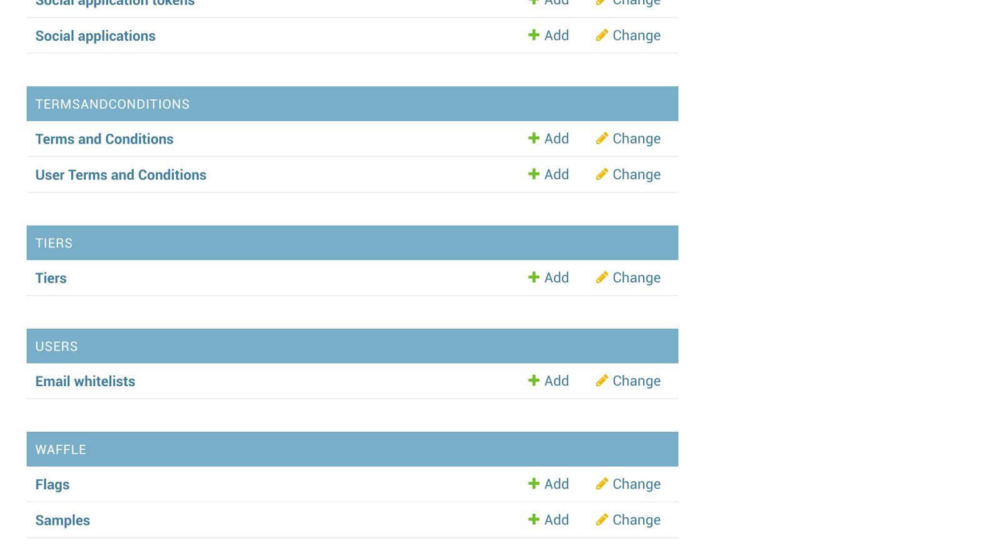
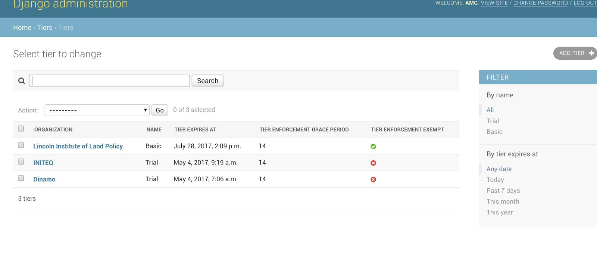
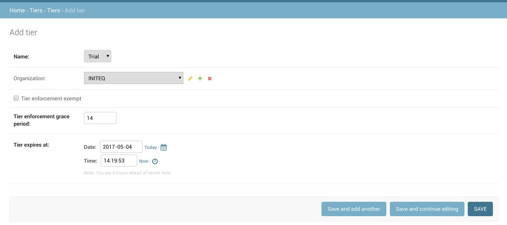

# Tahoe Tiers

Go to [AMC django admin](https://amc-app.appsembler.com/admin).

`NOTE`: You can only log in if your account is a superuser, if not then either
use a shared superuser account or ask someone from Red Team to make you a
superuser.

To See Tiers data scroll down to the "Tiers" app:

Click on Tiers and you should see a list of all Organizations that have been
assigned a Tier:

In the top right corner you can tie an Organization to a Tier. Click on "Add
Tier":

In the dropdown lists, select an Organization and a Tier (currently we only
have "Trial" and "Basic"). The only difference between the 2 (in terms of code
that's implemented right now) is that Trial should display a warning to the
user when they're nearing the end of the trial. (There is a bug currently
that's preventing that message from showing but we should fix that this
sprint).

Apart from that the only difference between Basic and Trial is only for our
benefit so that we can distinguish the customers.

The system will not let you create multiple Tiers for the same organization.
It's a one on one mapping and if a Tier already exists for the organization it
will tell you so when saving.

Set the date manually when you wish the tier to expire and the system will make
sure to []redirect the user to [this page](https://amc-app.appsembler.com/expired/) when the tier has expired.
This message is currently hardcoded for the Trial tier.
We should fix that in the coming sprints.

`NOTE`: The grace period number (defaults to 14) is currently not used. We're
waiting on a business decision on what to do with that.

If you wish to add a tier to an organization but for the time being allow them
indefinite access (without enforcing the expiration date) then please check the
"Tier enforcement exempt" checkbox. We're not yet sure if this will be useful.

`NOTE`: If an Organization does not have a tier assigned they are automatically
exempt from any expiration. So, all existing users don't actually have a Tier
assigned. We would have to go in manually and decide which tier to assign to
which organization in the system (which we're leaving to the business folks)

`NOTE`: However, as of today (April 4th) if a new user signs up they will
automatically be assigned a Trial tier. Trial tier defaults to 30 days (but can
be changed/extended manually in the admin after the fact). Let us know if we
should change the default to 14 days.

